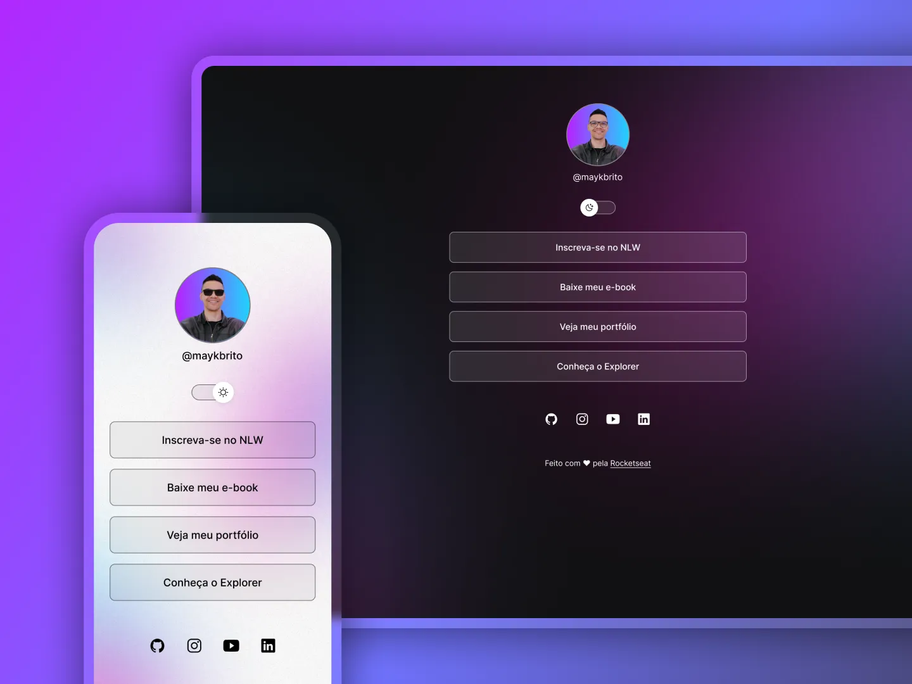

#  Projeto: Portfólio Interativo/DevLinks

## 📌 Descrição

Este projeto foi desenvolvido e disponibilizado de forma **gratuita** pela **Rocketseat**, como parte de estudos em HTML, CSS e JavaScript.  
O objetivo é criar uma página interativa e estilizada, aplicando animações e recursos visuais modernos.

- DevLinks é um agregador de Links para usar como cartão de visitas online.

## 🚀 Tecnologias usadas

- **HTML5** → estrutura do site
- **CSS3** → estilos, cores e responsividade
- **JavaScript (JS)** → interatividade e funções dinâmicas
- **Git e GitHub** → versionamento de código e hospedagem do projeto
- **Figma** → prototipagem e design da interface

## 📂 Estrutura do projeto

- `índice.html` → Página principal
- `estilo.css` → Arquivo de estilos
- `script.js` → Funções e interatividade
- `extensão.json` / `configurações.json` → Arquivos de configuração
- Imagens e ícones:
  - `avatar.png` / `avatar-light.png`
  - `bg-desktop.jpg` / `bg-desktop-light.jpg`
  - `bg-mobile.jpg` / `bg-mobile-light.jpg`
  - `lua.estrelas.svg`
  - `sol.svg`

---

<p align="center">
  
</p>

---

## 🎯 Como visualizar

1. Baixe ou clone este repositório:
   ```bash
   git clone https://github.com/Christine-ux-sud/LorrayneChristine.git
   ```
